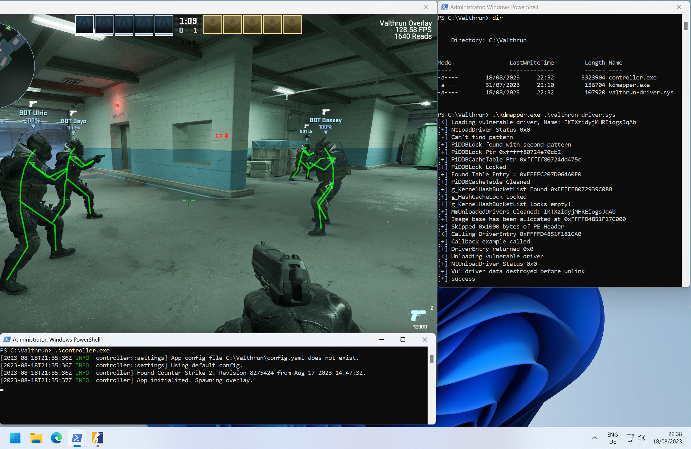

<div align="center">


# ⚡ Valthrun Enhanced CS2

**The smoothest external read-only CS2 overlay ever built.**

CS2 updates entity positions at **64 Hz**. Your monitor draws at **240+ Hz**.
Stock overlays render the gap between those two numbers as stutter.
**Valthrun Enhanced erases the gap** — with snapshot interpolation, a dedicated
memory-reader thread, and a near-zero-allocation render path.

<br/>

<a href="https://github.com/iarhaaan/valthrun-enhanced/actions"></a>
<a href="https://github.com/iarhaaan/valthrun-enhanced/releases"></a>
<a href="https://valth.run/download"></a>


<br/>
<br/>



<br/>

[✨ Why It's Better](#-why-valthrun-enhanced-is-better) ·
[🧠 Architecture](#-the-zero-lag-architecture) ·
[🚀 Setup](#-quick-setup--usage-guide) ·
[🎮 Features](#-feature-set) ·
[🛠️ Build](#️-compiling-from-source)

</div>

---

## 🌟 Overview

**Valthrun Enhanced** is an open-source, **read-only, non-injected** external gameplay overlay for Counter-Strike 2, forked from the excellent [Valthrun](https://github.com/Valthrun/valthrun-cs2) project.

Stock Valthrun reads game memory and renders ESP **on the same thread, at the same moment**. Since CS2 only updates entity positions at **64 Hz**, projecting those raw positions onto a 144/240/360 Hz monitor produces visible stepping and micro-stutter — and because every driver read happens *inside* the render frame, any kernel latency spike becomes a visible hitch.

**Valthrun Enhanced rebuilds the entire data path** to fix this at the architecture level — while remaining 100% read-only and non-injected.

---

## 🆚 Why Valthrun Enhanced Is Better

| System | 📦 Stock Valthrun | ⚡ Valthrun Enhanced |
| :--- | :--- | :--- |
| **ESP Motion** | Raw 64 Hz positions rendered per frame → visible stepping | **Snapshot Interpolation Engine** — renders *between* game states for mathematically linear motion |
| **Memory Reads** | Synchronous driver reads inline on the render thread | **Dedicated background reader thread** (default 300 Hz) — the render thread never touches the driver |
| **Frame Pacing** | Fixed per-frame LERP (behaves differently at 144 vs 240 FPS) | **Time-based interpolation** — frame-rate independent at any refresh rate |
| **Read → Render Handoff** | Same thread (blocking) | **Lock-free `ArcSwap` double-buffered snapshots** — zero locks, zero copies on the hot path |
| **Hot-Path Allocations** | Deep-clones bone matrices per player per frame | **Recycled buffers** — near-zero allocations while polling and rendering |
| **Observability** | FPS counter | **Frame-time 1% low, reader rate, tick cadence, snapshot age — live in the overlay** |
| **Latency Modes** | One fixed behavior | **Two modes:** `Silky` (interpolated, smoothest) and `Zero-Delay` (velocity-extrapolated, lowest latency) |
| **Respawn Safety** | Position smearing possible on teleports | **Large-jump detection flushes interpolation history instantly** — no ghost trails |
| **Stealth & Safety** | 100% Read-Only / Non-Injected | **100% Read-Only / Non-Injected** *(unchanged)* |

> **Bottom line:** the render thread in Valthrun Enhanced does exactly one thing with game memory — **an atomic pointer swap**. Everything else happens off-thread.

---

## 🧠 The Zero-Lag Architecture

```
┌───────────────────────┐   fixed-rate poll (up to 1000 Hz)  ┌──────────────────────┐
│  Memory Reader Thread │ ──────────────────────────────────▶│  Lock-free snapshot  │
│  (all driver reads,   │      immutable EspSnapshot         │  swap (ArcSwap       │
│   double-buffered)    │                                    │  double buffer)      │
└───────────────────────┘                                    └──────────┬───────────┘
                                                                        │ latest
                       ┌────────────────────────────────────────────────▼──────────┐
                       │  Render thread (uncapped, zero driver reads)              │
                       │  • Per-entity ring buffer of timestamped snapshots        │
                       │  • Renders at now − adaptive delay (Silky) or             │
                       │    extrapolates via real velocity (Zero-Delay)            │
                       │  • Origin + all bones interpolated in lockstep            │
                       └───────────────────────────────────────────────────────────┘
```

> [!TIP]
> **Snapshot Interpolation ("Silky" mode — default)**
> The overlay records timestamped snapshots of every player's origin and bone positions, then renders slightly in the past, interpolating *between* the two nearest game states. The 64 Hz memory staircase becomes perfectly linear motion. The delay **auto-tunes itself** to the measured game tick cadence — there is nothing to configure.

> [!NOTE]
> **"Zero-Delay" mode**
> Prefer zero added latency over perfect linearity? The engine extrapolates from the newest snapshot using real velocity — clamped (`max_extrapolate_ms`, default 24 ms) so it can never visibly overshoot.

> [!IMPORTANT]
> **Why the reader thread matters**
> Every driver read is a kernel transition. On stock Valthrun, those happen *inside* your render frame — any spike is a visible hitch. In Valthrun Enhanced, driver latency can no longer stall a single rendered frame.

> [!CAUTION]
> **Teleport & respawn safety**
> A large single-tick position jump flushes an entity's interpolation history instantly — no smearing across the map on respawns, teleports, or entity-ID recycling. Smoothing can also be disabled entirely in settings, restoring stock behavior.

---

## 🎛️ Smoothing Settings (ESP → Smoothing)

| Setting | Default | What it does |
| :--- | :--- | :--- |
| **Enable ESP smoothing** | `On` | Master switch. Off = raw stock behavior. |
| **Mode** | `Silky` | `Silky` interpolates (smoothest). `Zero-Delay` extrapolates (lowest latency). |
| **Adaptive delay** | `On` | Matches render delay to the measured game tick rate automatically. |
| **Interpolation delay** | `10 ms` | Manual delay when adaptive is off. |
| **Max extrapolation** | `24 ms` | Cap on velocity projection into the future. |
| **Reader poll rate** | `300 Hz` | Background thread read rate (clamped 1–1000 Hz). Anything above ~128 Hz is freshness headroom — the game ticks at 64 Hz. |

Live diagnostics are rendered directly below the settings: **tick cadence, effective delay, tracked players, snapshot age, and reader rate** — plus a **frame-time 1% low** readout in the watermark, so smoothness is *measured*, not guessed.

<div align="center">

</div>

---

## 🚀 Quick Setup & Usage Guide

### Step 1 — Download the Valthrun Loader
The official loader maps the read-only kernel driver:
👉 **[Download Valthrun Loader (valth.run/download)](https://valth.run/download)**

### Step 2 — Obtain `controller.exe`
- Grab the latest build from **[Releases](https://github.com/iarhaaan/valthrun-enhanced/releases)**, or
- Compile it yourself (see [🛠️ Compiling From Source](#️-compiling-from-source)).

### Step 3 — Launch Sequence
1. Start **Counter-Strike 2**.
2. Set **Settings → Video → Display Mode** to **"Fullscreen Windowed"** (Borderless).
3. Open the **Valthrun Loader** and map the read-only memory driver.
4. Place `controller.exe` inside the **Valthrun Loader directory**.
5. Launch `controller.exe`.
6. Press **`PAUSE`** to toggle the interactive settings menu. 🎉

---

## 🎮 Feature Set

| Category | Features |
| :--- | :--- |
| **Player ESP** | 2D/3D boxes · skeleton with per-bone interpolation · health bars · head dot · tracer lines · off-screen arrows |
| **Player Info** | Name · weapon · ammo · HP text · distance · grenades · flags (kit / bomb carrier / scoped / flashed) |
| **Weapon ESP** | World weapon boxes & names, filterable per weapon or per weapon group |
| **Chicken ESP** | Boxes, skeletons, and owner labels for chickens 🐔 |
| **Bomb Tools** | Detonation timer with defuse tracking · world-space bomb label (planted + dropped) |
| **Triggerbot** | Randomized delay window · team check · post-delay target retest |
| **Aim Assistant** | Aim target tracking with per-weapon configuration |
| **Spectator List** | See who's watching you, in a clean header panel |
| **Grenade Helper** | Per-map lineup spots with position & angle guidance |
| **Sniper Crosshair** | Overlay dot while holding a sniper rifle |
| **Web Radar** | Broadcast player positions over WebSocket to a standalone browser radar (React web app) |
| **Stream-Proofing** | Optional screen-capture exclusion (`WDA_EXCLUDEFROMCAPTURE`) |
| **Memory Backends** | Kernel IOCTL driver · Win32 API · KVM · PCILeech DMA |

---

## 🏗️ Project Structure

```
controller/     ESP, triggerbot, bomb tools, menu UI, memory reader thread, interpolation engine
cs2/            CS2 memory reading: handles, entities, runtime Source 2 schema resolver, offsets
overlay/        Transparent GPU overlay window (DirectX 11 / Vulkan / OpenGL) + input passthrough
cs2-schema/     Source 2 schema definitions, dumper, and CUtl container implementations
radar/          Web radar: broadcast client, WebSocket server, React/TypeScript web app
utils/state/    Thread-safe state registry syncing memory thread ↔ overlay ↔ radar
kernel/driver   Read-only kernel driver (git submodule → valthrun-driver)
```

See **[ARCHITECTURE.md](ARCHITECTURE.md)** for the full feature-to-file map.

---

## 🛠️ Compiling From Source

### Prerequisites
- **Git** — [git-scm.com](https://git-scm.com)
- **Rust toolchain** — [rustup.rs](https://rustup.rs)
- **Rust Nightly** — `rustup toolchain install nightly`

### Build

```powershell
# 1. Clone (with submodules)
git clone --recurse-submodules https://github.com/iarhaaan/valthrun-enhanced.git
cd valthrun-enhanced

# 2. Build the optimized release executable
cargo +nightly build --release -p controller
```

The binary lands at `target/release/controller.exe`.

> [!TIP]
> The release profile builds with **LTO** and `panic = "abort"` for maximum performance. Build scripts and proc-macros are compiled in release mode even for dev builds, so iteration stays fast.

---

## 🛡️ Stealth & Anti-Cheat Safety

- **100% Read-Only** — zero writes to CS2 process memory. The interpolation engine and reader thread only ever *read*.
- **Zero Injection** — no DLLs are injected into `cs2.exe`. Ever.
- **Standalone DirectX Overlay** — rendered via an independent transparent window (`DwmExtendFrameIntoClientArea`).
- **Optional capture exclusion** — `SetWindowDisplayAffinity(WDA_EXCLUDEFROMCAPTURE)` hides the overlay from screen capture.
- **Obfuscated strings** — sensitive strings are obfuscated at compile time (`obfstr`).

> [!WARNING]
> Read-only external overlays minimize detection surface, but **no software can guarantee immunity** from anti-cheat action. Use at your own risk.

---

## 📜 License & Credits

- Original Valthrun project by the **[Valthrun Team](https://github.com/Valthrun/valthrun-cs2)** — the foundation this fork builds on.
- Read-only kernel driver by **[WolverinDEV](https://github.com/WolverinDEV/valthrun-driver)**.
- **Valthrun Enhanced** maintained by **[iarhaaan](https://github.com/iarhaaan/valthrun-enhanced)**.
- Licensed under the terms of the original project — see **[LICENSE](LICENSE)**.

---

<div align="center">

**If Valthrun Enhanced made your game smoother, drop a ⭐ on the repo.**

<sub>64 Hz game. 240 Hz monitor. Zero stutter.</sub>

</div>
